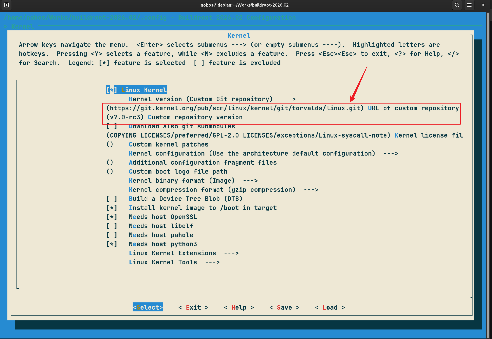
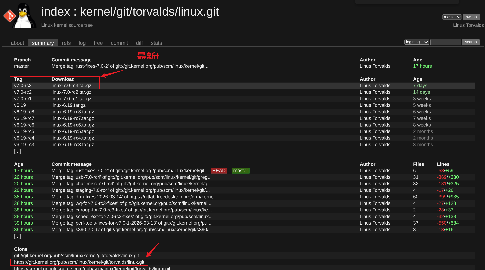

# 基于buildroot+qemu搭建linux内核开发环境.md

## 1. Host环境介绍

​	Host环境如下所示

```shell
nobos@debian:~/Works$ fastfetch 
        _,met$$$$$gg.          nobos@debian
     ,g$$$$$$$$$$$$$$$P.       ------------
   ,g$$P""       """Y$$.".     OS: Debian GNU/Linux 13 (trixie) x86_64
  ,$$P'              `$$$.     Host: 83AR (XiaoXinPro 16 APH8)
',$$P       ,ggs.     `$$b:    Kernel: Linux 6.12.73+deb13-amd64
`d$$'     ,$P"'   .    $$$     Uptime: 1 hour, 40 mins
 $$P      d$'     ,    $$P     Packages: 1948 (dpkg), 9 (flatpak)
 $$:      $$.   -    ,d$$'     Shell: bash 5.2.37
 $$;      Y$b._   _,d$P'       Display (CSO1615): 2560x1600 @ 120 Hz (as 2048x1280) in 16" [Built-in]
 Y$$.    `.`"Y$$$$P"'          DE: GNOME 48.7
 `$$b      "-.__               WM: Mutter (Wayland)
  `Y$$b                        WM Theme: Adwaita
   `Y$$.                       Theme: Adwaita [GTK2/3/4]
     `$$b.                     Icons: Adwaita [GTK2/3/4]
       `Y$$b.                  Font: Cantarell (11pt) [GTK2/3/4]
         `"Y$b._               Cursor: Adwaita (24px)
             `""""             Terminal: tabby 1.0.230
                               Terminal Font: monospace (22pt)
                               CPU: AMD Ryzen 7 7840HS (16) @ 5.14 GHz
                               GPU: AMD Radeon 780M [Integrated]
                               Memory: 7.04 GiB / 27.19 GiB (26%)
                               Swap: 256.00 KiB / 3.72 GiB (0%)
                               Disk (/): 16.03 GiB / 932.32 GiB (2%) - ext4
                               Disk (/home): 52.24 GiB / 937.82 GiB (6%) - ext4
                               Local IP (wlp2s0): 192.168.5.193/24
                               Battery (L22M4PF5): 97% [AC Connected]
                               Locale: zh_CN.UTF-8
```

## 2. 安装qemu

​	本文采用了apt方式直接安装

```shell
sudo apt install qemu-system
```

​	安装完成后查看可以安装的版本为10.0.7，如果需要特定的版本可以从qemu的官网下载源码自行编译安装

```shell
nobos@debian:~/Works$ qemu-system-aarch64 --version
QEMU emulator version 10.0.7 (Debian 1:10.0.7+ds-0+deb13u1+b1)
Copyright (c) 2003-2025 Fabrice Bellard and the QEMU Project developers
```

## 3. 安装buildroot

​	下载buildroot源文件压缩包

```shell
nobos@debian:~/下载$ wget https://buildroot.org/downloads/buildroot-2026.02.tar.gz
```

​	解压

```shell
nobos@debian:~/下载$ tar -xvf buildroot-2026.02.tar.gz && cd buildroot-2026.02
```

​	配置

```shell
nobos@debian:~/下载/buildroot-2026.02$ make qemu_aarch64_sbsa_defconfig
```

​	编译，由于网络限制，整个编译过程会消耗比较长的时间

```shell
nobos@debian:~/下载/buildroot-2026.02$ make -j16
```

​	等待编译完成后查看output/images生成的镜像文件以及启动脚本start-qemu.sh

```shell
nobos@debian:~/下载/buildroot-2026.02$ ls output/images
bl1.bin  bl2.bin  bl31.bin  disk.img  efi-part  efi-part.vfat  fip.bin  Image  rootfs.ext2  rootfs.ext4  SBSA_FLASH0.fd  SBSA_FLASH1.fd  start-qemu.sh
```

## 4. 运行qemu

​	执行buildroot生成的启动脚本start-qemu.sh，进入qemu虚拟机后cat /proc/version，环境da jin

```shell
nobos@debian:~/下载/buildroot-2026.02$ ./output/images/start-qemu.sh

# cat /proc/version 
Linux version 6.18.7 (nobos@debian) (aarch64-buildroot-linux-gnu-gcc.br_real (Buildroot 2026.02) 14.3.0, GNU ld (GNU Binutils) 2.44) #1 SMP PREEMPT Sun Mar  8 11:24:22 CST 2026
```

## 5. 基于该环境进行内核开发

​	配置buildroot的kernel选项，个人仓库（Custom Git repository）的地址从https://git.kernel.org/pub/scm/linux/kernel/git/torvalds/linux.git/获取，国内建议选择https协议，git下不动



​	个人仓库版本（Custom repository version）填写最新tag V7.0-rc3	



​	填写好上述两个信息后重新编译buildroot后，重新启动qemu系统，发现内核更新到最新tag的版本

```shell
nobos@debian:~/Works/buildroot-2026.02$ make -j16
nobos@debian:~/Works/buildroot-2026.02$ ./output/images/start-qemu.sh
# cat /proc/version 
Linux version 7.0.0-rc3 (nobos@debian) (aarch64-sbsa-linux-gnu-gcc.br_real (Buildroot 2026.02) 14.3.0, GNU ld (GNU Binutils) 2.44) #1 SMP PREEMPT Sun Mar 15 21:00:23 CST 2026
```

​	buildroot将内核的源码、编译后的内核树分别放在dl/linux/git和output/build/linux-v7.0-rc3

```shell
nobos@debian:~/Works/buildroot-2026.02/dl/linux/git$ ls
arch   COPYING  Documentation  include   ipc      kernel    MAINTAINERS  net     samples   sound  virt
block  CREDITS  drivers        init      Kbuild   lib       Makefile     README  scripts   tools
certs  crypto   fs             io_uring  Kconfig  LICENSES  mm           rust    security  usr
nobos@debian:~/Works/buildroot-2026.02/output/build/linux-v7.0-rc3$ ls
arch        crypto         io_uring  LICENSES                 modules.order   scripts     virt
block       Documentation  ipc       MAINTAINERS              Module.symvers  security    vmlinux
built-in.a  drivers        Kbuild    Makefile                 net             sound       vmlinux.a
certs       fs             Kconfig   mm                       README          System.map  vmlinux.o
COPYING     include        kernel    modules.builtin          rust            tools       vmlinux.symvers
CREDITS     init           lib       modules.builtin.modinfo  samples         usr         vmlinux.unstripped
```

​	dl/linux/git的内核树就是从内核官网拉至本地的，接下来就是愉快的内核开发环节啦^_^
